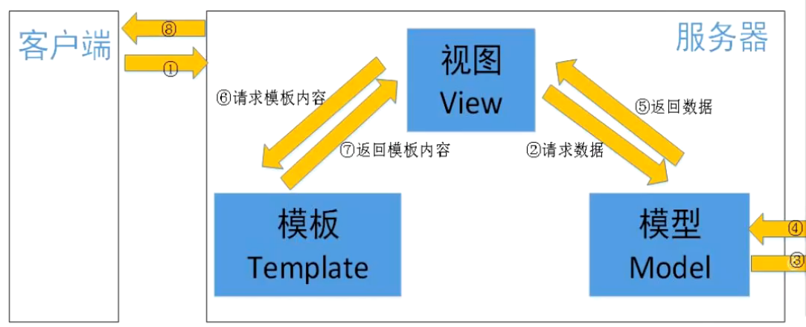

# Django - 初探

## 1、创建django项目

```bash
django-admin startproject djangodemo .
```
- "."代表在当前目录下创建项目，会把当前目录作为项目的根目录
- 不加"."，会在当前目录下创建一个完整的项目

## 2、创建子应用app

```bash
python manage.py startapp hello
```

## 3、修改配置项（settings.py）

```python
INSTALLED_APPS = [
    'django.contrib.admin',
    'django.contrib.auth',
    'django.contrib.contenttypes',
    'django.contrib.sessions',
    'django.contrib.messages',
    'django.contrib.staticfiles',
    'hello' # 新创建的App需要进行注册
]

# 修改语言
LANGUAGE_CODE = 'zh-hans'
# 修改时区
TIME_ZONE = "Asia/Shanghai"
```

## 4、运行

```bash
python manage.py runserver
```

## 5、django工程目录结构

### 1） 与项目名称同名的目录（保存django的项目配置信息）
- sagi.py	用于启动ASGI协议的启动问题
- settings.py	用于存放Django的全局配置信息
- urls.py	用于创建全局路由信息
- wsgi.py	兼容WSGI协议的web服务器入口文件

### 2）子应用结构
- migtations	用于存放数据库迁移历史记录的目录
- admin.py	跟网站的后台管理站点配置相关的文件
- apps.py	用于配置当前子应用相关信息的文件
- models.py	保存数据库模型类
- tests.py	用于编写单元测试
- views.py	用于编写web应用视图

### 3）manage.py	用于多种方式与django项目交互的命令行工具

## 6、 path函数

```bash
from django.urls import path
```

- 用于定义路由条录
    - 第一个参数为url路径，默认最后的/需要添加
    - 第二个参数为需要调用的函数，直接使用函数名即可

## 7、引入子应用中的路由urls.py

```python
from django.urls import path,include

path('project/', include("projects.urls"))
```

## 8、发送POST请求需注意

```python
MIDDLEWARE = [
    'django.middleware.security.SecurityMiddleware',
    'django.contrib.sessions.middleware.SessionMiddleware',
    'django.middleware.common.CommonMiddleware',
    # 默认发起GET、OPTIONS以外的请求，需要携带CSRF TOKEN才行
    # 可以将CsrfViewMiddleware中间件注释掉
    # 'django.middleware.csrf.CsrfViewMiddleware',
    'django.contrib.auth.middleware.AuthenticationMiddleware',
    'django.contrib.messages.middleware.MessageMiddleware',
    'django.middleware.clickjacking.XFrameOptionsMiddleware',
]
```

## 9、视图函数
- 好理解
- 代码可读性与复用性都不佳
```python
def index(request):
    if request.method == 'GET':
        return HttpResponse("GET请求")
    return HttpResponse("hello world")
```
- a. request: 为HttpRequest对象，存放了用户所有的请求信息
- b. 可以使用HTTPRequest对象中method属性获取请求方法
- c. 通过不同的方法，执行不同的逻辑

## 10、类视图

### 1）优点
- 可读性和复用性更好
- 不同的请求方式以不同的方法呈现

### 2）定义类视图：
- a. 必须继承View父类或者子类
- b. 不同的请求方式，是以不同请求方法一一对应的
- c. GET ->get	POST->post	PUT->put		DELETE->delete

```python
## 创建类视图
from django.views import View

class ProjectViews(View):

    def get(self, request):
        """
        self：ProjectViews对象
        request：HttpRequest对象
        """
        return HttpResponse("GET 请求")

    def post(self, request):
        return HttpResponse("POST 请求")

    def put(self, request):
        return HttpResponse("PUT 请求")

    def delete(self, request):
        return HttpResponse("DELETE 请求")
        
## 添加路由
# 类视图.as_view()
path('project/', ProjectViews.as_view())
```

## 11、templates模板配置（创建templates模板文件夹）
```python
import os
TEMPLATES = [
    {
        'BACKEND': 'django.template.backends.django.DjangoTemplates',
        # 指定模板存放的绝对路径
        'DIRS': [os.path.json(BASE_DIR,'templates')],
        'APP_DIRS': True,
        'OPTIONS': {
            'context_processors': [
                'django.template.context_processors.debug',
                'django.template.context_processors.request',
                'django.contrib.auth.context_processors.auth',
                'django.contrib.messages.context_processors.messages',
            ],
        },
    },
]
```

## 12、请求参数

### query string 查询字符串参数：?name=dd&age=18
- 可以使用request.GET获取
- request.GET是QueryDict类型，可以类比为python中的dict类型
- 可以使用request.GET["参数名"]或者使用request.GET.get("参数名")
- 可以获取多个相同key的查询字符串参数
- 使用request.GET["参数名"]或者使用request.GET.get("参数名")，获取的是最后一个参数
- request.GET.getlist("参数名")，获取所有的参数，且为列表类型

### 在POST请求体中，可以传递请求体参数（x-www-form-urlencoded）
- 可以使用request.POST获取
### 在POST请求体中，可以传递请求体参数（application/json）
- 可以使用request.body来获取所有请求体参数（request.body.decode('utf-8')）
- 需要使用json模块转换成字典之后再提取值
### 在请求体中，可以传递请求体参数（multipart/form-data）
- 传递的文本参数可以使用request.POST去获取
- 传递到非文本参数可以使用request.body去获取
### 请求头参数
- 可以使用request.META获取请求头参数，是一个字典类型
- 请求头中的key值会被转化为HTTP_参数名大写

## 13、响应
- 视图中必须返回HTTPResponse对象或子对象
- HTTPResponse(content = 响应体, content_type = 响应数据类型, status = 状态码)
- JsonResponse(data = jsondata, safe=True，status = 状态码)
    - 如果第一个参数为字典无需safe关键字参数参数
    - 如果第一个参数为嵌套字典的列表，那么必须执行safe=False关键字参数

## 14、MVT模式

- M mdoel，与MVC中M的功能相同，负责和数据库交互，进行数据处理
- V View，与MVC中C功能相同，接收请求，进行业务处理，返回响应
- T Template，与MVC中V功能相同，负责构造要返回的HTML页面
- 在前后端分离的项目中没有T，只有MV