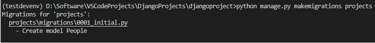
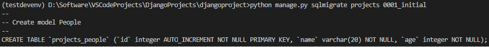
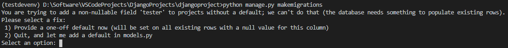

# Django-ORM

## 一、使用pymysql执行原生SQL语句来操作数据，痛点
- SQL语句比较复杂
- SQL语句安全性无法保证
- 数据库创建、数据表生成、数据添加以及数据迁移等非常麻烦
- SQL语句性能不够好，同时SQL语句不好管理

## 二、ORM框架

- 把类和数据库表进行映射
- 通过类和对象就能操作它所对应表格中的数据（CRUD）

```bash
# 使用MySQL数据库需要安装依赖
pip install pymysql
pip install mysqlclient
```

### 1. 配置
```python
DATABASES = {
    'default': {
        # 数据库引擎
        'ENGINE': 'django.db.backends.sqlite3',
        'NAME': BASE_DIR / 'db.sqlite3',
    },
    'mysql': {
        # 执行使用的数据库引擎（使用哪种类型的数据库）
        'ENGINE': 'django.db.backends.mysql',
        # 指定数据库名称
        'NAME': 'django_db',
        'USER': 'root',
        'PASSWORD': '123456',
        'HOST': 'localhost',
        'PORT': '3306'
    }
}
```

### 2. 创建模型类（models.py）
- 定义模型类必须继承Model或者Model子类，一个模型类相当于一个table
- 定义的类属性（Field对象）为表中的字段信息
- 默认表名为子应用名_模型类名小写
- 默认会自动创建一个id主键（自增非空）
```python
from django.db import models

class People(models.Model):

    name = models.CharField(max_length=20)
    age = models.IntegerField()
```

### 3. 生成迁移脚本（会自动放置到子应用的migrations目录中）
```bash
python manage.py makemigrations projects
python manage.py makemigrations 子应用名
# 不指定的话就是所有的注册的模型
python manage.py makemigrations
```


### 4. 查看创建表sql语句（只是查看sql，不会真正的创建表）
```bash
python manage.py sqlmigrate projects 0001_initial
python manage.py sqlmigrate 子应用名 迁移脚本
```


### 5. 执行迁移脚本，生成表
```bash
python manage.py migrate projects
python manage.py migrate 子应用名
# 不指定就是所有的
python manage.py migrate
```


## 三、模型字段

### 1. 字段类型
- CharField指定varchar类型
    - 必须得设置max_length参数，指定最大长度
- BooleanField指定布尔类型
- TextField指定长文本类型
- DateTimeField指定日期类型
    - a.auto_now_add=True创建一条数据时，会自动将当前时间赋值给当前字段(只会在创建的时候修改一次)
    - b.auto_now=True每次在更新数据时，会自动将当前时间赋值给当前字段（只要修改就会自动更新）属性
- verbose_name与help_text指定中文的描述，在admin后台站点以及在接口文档平台中会使用到
- unique =True 设置唯一约束，默认unique=False
- default 设置当前字段的默认值
- null 指定当前字段是否允许保存null空值
- blank 指定前端在创建数据时是否允许不输入
- primary_key 指定当前字段是否为主键（一个数据库模型类中只允许定义一个设置了参数primary_key = True的字段）
    - 一旦某个字段设置了primary_key = True，那么orm框架就不会自动创建id主键

### 2. 修改当前表的元数据信息（可以在Meta内部类中修改当前表的元数据信息）
```python
class Meta:
        # 可以在Meta内部类中修改当前表的元数据信息
        # db_table执行创建的数据表名称
        db_table = 'tb_projects'
        # 指定创建的数据表的中文描述信息
        verbose_name = '项目表'
        verbose_name_plural = '项目表'
```

### 3. 整体demo
```python
class Projects(models.Model):

    id = models.AutoField(
        primary_key=True, verbose_name="id主键", help_text="id主键")
    name = models.CharField(verbose_name="项目名称",
                            help_text="项目名称", max_length=20, unique=True)
    leader = models.CharField(verbose_name="项目负责人",
                            help_text="项目负责人", max_length=10)
    is_execute = models.BooleanField(
        verbose_name="是否开展", help_text="是否开展", default=True)
    desc = models.TextField(verbose_name="项目描述信息",
                            help_text="项目描述信息", null=True, blank=True, default="")
    create_time = models.DateTimeField(
        auto_now_add=True, verbose_name="创建时间", help_text="创建时间")
    update_time = models.DateTimeField(
        auto_now=True, verbose_name="更新时间", help_text="更新时间")

    class Meta:
        db_table = 'tb_projects'
        verbose_name = '项目表'
        verbose_name_plural = '项目表'
```

## 四、新增字段（在已有数据表中新增字段）
### 1. 新增字段
```python
tester = models.CharField(max_length=10)
```
### 2.执行
```python
python manage.py makemigrations
```

- 有两个选项：
    - 现在提供一个一次性默认值（将在所有现有行上对此列设置空值）
    - 退出，在新添加的字段上增加默认值


## 五、关联关系
### 1）一对多关系（ForeignKey）
#### 可以使用ForeignKey在从表（一对多的‘多’的一方）中指定外键字段
- a.第一个字段需要指定关联的父表，往往使用 '子应用名.父表模型类名'
- b.必须执行on_delete级联删除策略
- c.级联删除策略有如下种类
    - 1.CASCADE：当父表数据删除后，对应的从表数据会被自动删除
    - 2.SET_NULL：当父表数据删除后，对应的从表数据的外键字段会被自动设置为null
    - 3.PROTECT：当父表数据删除时，如果存在对应的从表数据，那么会抛出异常
    - 4.SET_DEFAULT：当父表数据删除后，对应的从表数据的外键字段会被自动设置为default参数指定的值

#### 整体demo
```python
class Interfaces(models.Model):

    id = models.AutoField(
        primary_key=True, verbose_name="id主键", help_text="id主键")
    name = models.CharField(verbose_name="接口名称",
                            help_text="接口名称", max_length=20, unique=True)
    tester = models.CharField(verbose_name="测试人员",
                              help_text="测试人员", max_length=10)

    # 创建数据表时，会自动创建projets_id作为字段名，用于存放父表外键值
    projects = models.ForeignKey(
        'projects.Projects', on_delete=models.CASCADE)
    create_time = models.DateTimeField(
        auto_now_add=True, verbose_name="创建时间", help_text="创建时间")
    update_time = models.DateTimeField(
        auto_now=True, verbose_name="更新时间", help_text="更新时间")

    class Meta:
        db_table = 'tb_interfaces'
        verbose_name = '接口表'
        verbose_name_plural = '接口表'
```
### 2）多对多关系（ManyToManyField）
### 3）一对一关系（OneToOneField）

## 六、抽象基类
- 因为某些模型类，仅仅是将多个模型类中公共的字段抽取出来，而不需要生成数据表
- 因此我们可以使用Meta内部类通过abstract指定当前模型类为抽象模型类
- 别的模型类继承BaseModel即可
```python
class BaseModel(models.Model):
    id = models.AutoField(
        primary_key=True, verbose_name="id主键", help_text="id主键")
    create_time = models.DateTimeField(
        auto_now_add=True, verbose_name="创建时间", help_text="创建时间")
    update_time = models.DateTimeField(
        auto_now=True, verbose_name="更新时间", help_text="更新时间")
    class Meta:
        abstract = True
```

## 七、增删改查（CRUD）

### 1）增加数据（C）
#### 1. 方式一：
- 直接使用模型类来创建模型对象
- 必须调用save()方法才会执行SQL语句（提交）
```python
one_project = Projects(name="XXX金融项目11", leader="admin", desc="这是一个描述")
one_project.save()
```

#### 2.方式二：
- a.可以使用模型类.object为manager对象
- b.可以使用manager对象.create方法(关键字参数)
- c.无需调用save方法，会自动提交
```python
one_project = Projects.objects.create(name="抖音App10", leader="Tommy", desc="这是一个描述")
```

#### 3.添加子表数据
- 添加外键数据的时候，如果使用projects的时候projects=one_project
- 如果使用projects_id的时候projects_id=one_project.id
```python
# Interfaces(name="登录接口", tester="Any", projects_id=one_project.id)
# Interfaces(name="登录接口", tester="Any", projects=one_project)
one_interfaces = Interfaces.objects.create(name="注册接口", tester="Any", projects_id=one_project.id)
```

### 2）更新数据（U）

#### 1. 方式一：
- a.所有的模型类，会有一个默认的manager属性,是一个manager对象
- b.获取需要修改的模型类对象之后，重写相应的字段
- c.必须要调用save()方法，才会提交
```python
pro = Projects.objects.get(id=1)
pro.leader = "desire"
pro.save()
```
#### 2.方式二：
- a.现将待修改的数据取出（查询集对象）
- b.然后调用update()方法
- c.无需调用save()方法，会自动提交
```python
qs = Projects.objects.filter(id=1).update(leader="唯一")
```

### 3）查询数据（R）

#### 1. 查询多条数据
- a.使用模型类.object.all()
- b.返回QuerySet对象，类似于列表，但不是列表
- c.QuerySet对象，惰性查找，只有需要用到数据(len/取值/for)时，才会执行SQL语句
```python
qs = Projects.objects.all()
```

#### 2. 读取一条数据
##### ①方式一：
- a.可以使用模型类.objects.get()
- b.如果查询的结果不存在时候会报错 Projects matching query does not exist.
- c.如果查询的结果大于1条的时候会报错 get() returned more than one Projects -- it returned 2!
- d.get方法，往往会使用主键或者唯一键作为查询条件
- e.返回模型类对象(数据)
```python
pro = Projects.objects.get(id=1)
# pk为Django模型类内置的一个属性，是主键的别名
pro = Projects.objects.get(pk=1)
```
##### ②方式二：
- a.可以使用模型类.objects.filter()
- b.返回QuerySet对象
- c.如果查询的结果为空，那么也会返回空的QuerySet对象
- d.如果查询的结果超过一条，也会返回多条结果所在的QuerySet对象
- e.filter查询 ：段名__查询类型=具体值
- 查询类型种类
    - gt >
    - gte >=
    - lt <
    - lte<=
    - in 对处于列表中的值进行过滤
    - contains 包含
    - icontains 包含，忽略大小写
    - startswith 以XXX开头
    - istartswith 以XXX开头，忽略大小写
    - endswith 以XXX结尾
    - iendswith 以XXX结尾，忽略大小写
    - isnull 是否为空
- 关联查询：关联模型类名小写__关联模型类中的字段名__查询类型=具体值

```python
pro1 = Projects.objects.filter(id=1)
pro2 = Projects.objects.filter(id__gt=4)
pro3 = Projects.objects.filter(in=[1,4,8,25])
pro4 = Projects.objects.filter(update_time__gt="2021-01-18")
# 关联查询
pro4 = Projects.objects.filter(interfaces__name__contains='登录')
```
### 4）删除数据（D）
#### 1. 方式一：
- 调用模型类对象中的delete() 方法
```python
pro = Projects.objects.get(pk = 1)
pro.delete()
```
#### 2. 方式二：
- 使用查询集对象.delete()，可以将查询集中的所有数据删除
```python
qs = Projects.objects.filter(id=1).delete()
```

### QuerySet查询集的特性
- 惰性查询
- 链式调用
    - 查询集对象可以多次调用filter方法进行过滤
    - 多个filter中的过滤条件为"与"的关系
    - 在一个filter方法中，可以写多个条件，每个条件之间以"逗号"分割，每个条件为"与"的关系
- 哪些操作会让查询集执行SQL语句？查询集支持哪些操作
    - 通过数字索引取值，但不支持负值索引
    - 支持切片操作
    - 支持 .first()，可以取出查询集中第一个元素，为模型类对象
    - 支持 .last()，可以取出查询集中最后一个元素，为模型类对象
    - 支持 len(查询集对象)，获取查询集的长度，也可以使用 .count() 方法
    - 支持 .exists()，来判断查询集中是否有元素，如果有元素，则返回True，否则返回False
    - 支持 for 循环迭代

```python
pro = Projects.objects.filter(name__contains='商城').filter(leader='唯一')
pro = Projects.objects.filter(name__contains='商城', leader='唯一')
```
### 逻辑关系
- 与的关系
- 或的关系
    - 可以使用Q对象来实现逻辑关系查询
    - 多个Q对象之间使用 | ，为或的关系
    - 多个Q对象之间使用 &，为与的关系
```python
from django.db.models import Q
qs = Projects.objects.filter(Q(name__contains='商城') | Q(leader='唯一'))
```

### 排序操作
- 默认是以id主键升序(ASC)来排序的
- 查询集对象.order_by('字段名1', '字段名2')
- 默认指定的字段名为升序(ASC)
- 可以在字段名的前面添加 - ，代表以降序（DESC）来排序
```python
Projects.objects.all().order_by('-name','leader')
```

### 聚合运算
- values和annotate为固定写法
- 聚合运算需要设置为从表名小写
- 使用外键id作为关联条件，同时会把外键id作为分组条件
- 默认查询id和聚合运的值
- 聚合运算的别名会自动设置为从表名小写__聚合函数名小写
- 可以给聚合运算设置关键字参数，会作为聚合运算的别名
```python
form django.db.models import Count, Min, Max, Avg

Projects.objects.values('id').annotate(Count('interfaces'))
# 自定义聚合运算的别名
Projects.objects.values('id').annotate(interfaces = Count('interfaces'))
```

### 执行原生SQL语句
- 查询集.raw("原生SQL语句")

## 八、序列化和反序列化
- 序列化操作
    - 将模型类对象(Python中的类)转化为Python中的基本类型
        - 类：模型类、常用类
        - 基本类型：字典、嵌套字典的列表
- 反序列化操作
    - 将json字符串转化为Python中的基本类型 -> python中类