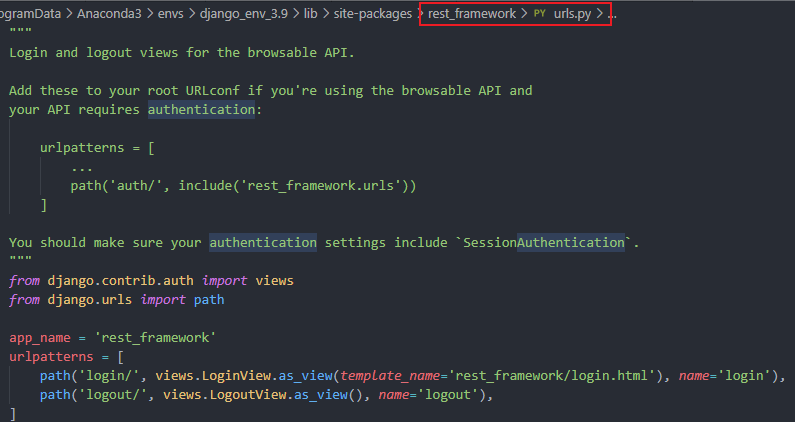
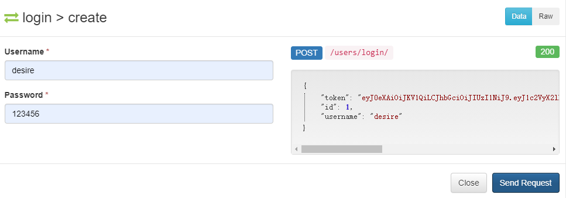

# Django REST framework

## 一、简介
- 在Django框架基础之上，进行二次开发
- 用于构建Restful API
- 简称DRF框架或REST framework框架

## 二、特性
- 提供了强大的Serializer序列化器，可以高效地进行序列化与反序列化操作
- 提供了极为丰富的类视图、Mixin扩展类、ViewSet视图集
- 提供了直观的Web API界面
- 多种身份认证和权限认证
- 强大的排序、过滤、分页、搜索、限流等功能
- 可扩展性，插件丰富

## 三、安装&配置

### 1.安装

```bash
pip install djangorestframework
pip install markdown # Markdown support for the browsable API
```

### 2.配置

```python
INSTALLED_APPS = [
    'django.contrib.admin',
    'django.contrib.auth',
    'django.contrib.contenttypes',
    'django.contrib.sessions',
    'django.contrib.messages',
    'django.contrib.staticfiles',
    'rest_framework', # 放在系统应用后
    # 注册子应用
    'projects',
    'interfaces',
]
```

## 四、序列化器

### 1. 定义序列化器类
- 必须得继承`Serializer`类或其子类
- 定义的序列化器类中的字段名称‘必须’与模型类中的字段名保持一致
- 默认定义哪些字段，那么哪些字段就会序列化输出，同时这些字段也必须输入（传递）
- 序列化器中定义的字段必须为Field子类
    - CharField 字符串类型
    - IntegerField int类型
    - BooleanField 布尔类型
    - DateTimeField 日期类型
```python
from rest_framework import serializers

class ProjectSerializer(serializers.Serializer):
    id = serializers.IntegerField()
    name = serializers.CharField()
    leader = serializers.CharField()
```

### 2. 使用序列化器
- a. 如果需要将一个查询集进行序列化，必须得指定many=True
- b. 需要给instance传参
- c. 如果将一个模型对象序列化，那么无需指定many=True
- d. 使用serializer中的data属性，可以获取序列化输出的数据（字典）
```python
pro = Projects.objects.all()
serializer = serializers.ProjectSerializer(instance=pro, many=True)
data = serializer.data

pro = Projects.objects.filter(pk=pk).first()
serializer = serializers.ProjectSerializer(instance=pro)
data = serializer.data
```

### 3.序列化器数据校验参数
- label和help_text，与模型类中字段的verbose_name和help_text一致
- CharField可以指定
    - min_length参数，为最小长度
    - max_length参数，为最大长度
    - trim_whitespace参数，是否截断空白字符
- IntegerField可以指定
    - min_value参数，为最小值
    - max_value参数，为最大值
- 序列化器字段设置write_only=True，该字段必须得输入（反序列化输入），但无需输出（序列化输出）
- 序列化字段设置read_only=True，该字段无需输入（反序列化输入），但必须得输出（序列化输出），不能与write_only=True一起用
- 序列化字段设置allow_null=True，该字段可以传null值
- 序列化字段设置allow_blank=True，该字段可以 传空字符串，可以与allow_null=True一起用
- 序列化字段设置required=False，该字段反序列化输入时，可以不传递
- 序列化字段设置default，为该字段设置默认值，会将默认值作为反序列化的输入值
- 序列化字段设置error_messages，设置自定义错误信息
    - 类型为字典
    - key为校验参数
    - value为错误信息
- DateTimeField可以指定
    - format="%Y-%m-%d %H:%M:%S" 格式化输出日期
    - format="%Y年%m月%d日 %H:%M:%S"

### 4.序列化器数据校验
- 在创建序列化器对象时，给data传参，那么可以实现数据校验
- data必须得传递Python中的基本类型（字典或者嵌套字典的列表）
- 必须得调用`is_valid()`方法，才会开始进行校验（校验的开关）
- 如果校验通过，会返回True，否则返回False
- `.errors`属性用于获取错误提示信息，往往为字典类型，必须得先调用is_valid方法才行
- `is_valid(raise_exception=True)`，当检验失败时，自动抛出异常信息
- 使用序列化器对象`.validated_data` 属性，获取校验通过之后的数据
- `.validated_data` 属性，必须校验（调用is_valid方法）之后，才能获取

```python
serializer = serializers.ProjectSerializer(data=data)
if not serializer.is_valid():
    err = serializer.errors
    return JsonResponse(data=err, json_dumps_params={"ensure_ascii": False}, status=400)
```

### 5.序列化器有哪些作用？
- 可以实现序列化输出
- 可以实现反序列化输入
- 数据校验
- 操作数据

### 6.关联字段序列化器

#### 1）父表获取从表的数据（必须得指定many=True，为列表的时候必须指定）

##### ① 默认使用从表模型类名小写_set
```python
interfaces_set = serializers.PrimaryKeyRelatedField(label='所属接口的id', help_text='所属接口的id', read_only=True, many=True)
```

##### ② 自定义名称（在从表模型类中定义外键字段时，可以指定elated_name参数，用于设置父表模型对象获取从表数据时，使用的属性名称）
```python
projects = models.ForeignKey('projects.Projects', on_delete=models.CASCADE,related_name="interfaces")
```
在获取从表数据时，就可以使用“interfaces”
```python
interfaces = serializers.PrimaryKeyRelatedField(label='所属接口的id', help_text='所属接口的id', read_only=True, many=True)
```
#### 2）在父表序列化器中，可以手动置顶关联字段的序列化类型
- PrimaryKeyRelatedField，指定从表的主键id值
    - PrimaryKeyRelatedField指定read_only=True，那么只输出从表外键id
    - 如果未指定read_only=True或者required=False，那么必须得指定queryset（指定检验时使用的查询集对象）
```python
interfaces = serializers.PrimaryKeyRelatedField(label='所属接口的id', help_text='所属接口的id', many=True, queryset=Interfaces.objects.all())
```
- StringRelatedField，用于在序列化输出时，调用关联模型类中的__str__方法
    - StringRelatedField 默认添加了让read_only=True，只用于序列化输出，而不会反序列化输入
```python
interfaces =serializers.StringRelatedField(many=True)
```
- SlugRelatedField，用于在序列化输出或者反序列化输入是，指定使用的关联模型类中的字段名
    - 如果未指定read_only=True或者required=False，那么必须得指定queryset（指定检验时使用的查询集对象）
    - 如果需要反序列化输入，那么slug_field必须得指定拥有唯一约束的字段名
```python
interfaces =serializers.SlugRelatedField(many=True,read_only=True,slug_field="tester")
```

### 7. 自定义校验器

#### 1）可以在序列化器字段上使用validators指定自定义校验器
- validators必须得指定为序列类型（往往为列表），在列表中可以添加多个检验器
- UniqueValidator校验器进行唯一约束的校验，必须得指定queryset参数，使用message指定具体报错信息
```python
from rest_framework.validators import UniqueValidator

name = serializers.CharField(
        label='项目名称', help_text='项目名称', write_only=True, max_length=10, min_length=3, error_messages={"min_length": "项目名称不能少于三位"}, 
        validators=[UniqueValidator(queryset=Projects.objects.all(),message="项目名不能重复")])
```
#### 2）可以自定义校验函数，对某个字段进行进一步复杂的校验
##### ① 自定义校验器函数
- value：前端传递的项目名称
- 如果校验失败，必须得返回ValidationError异常对象
    - 第一个参数可以指定具体的报错信息
```python
def is_contain_keyword(value):
    if '项目' not in value:
        raise serializers.ValidationError("项目中必须包含‘项目’关键字")
```
##### ② 自定义校验器函数使用，直接将函数名放置到`validators`列表中
```python
name = serializers.CharField(
        label='项目名称', help_text='项目名称', write_only=True, max_length=10, min_length=3, error_messages={"min_length": "项目名称不能少于三位"}, 
        validators=[UniqueValidator(queryset=Projects.objects.all(),message="项目名不能重复"),is_contain_keyword])
```
#### 3）可以在序列化器类中定义对单字段进行检验的方法
- 单字段检验方法的名称，必须以`validate_`作为前缀
- 接收的参数为前端传递的值
- 如果在字段定义时，校验不通过，那么不会调用序列化器类中单字段的检验方法
- 如果校验不通过，必须得返回ValidationError异常对象
- 如果校验通过。那么一般需要将校验之后的值返回
```python
def validate_name(self, value):
    if not value.endswith('项目'):
        raise ValidationError("项目名称中必须以'项目'结尾")
    return value
```
#### 4）validate用于多个字段的联合校验
- 接收的参数为前端传递的所有参数（但字段均校验通过）
- 如果在单字段的检验方法中检验不通过，那么不会调用`validate`
- 如果校验不通过，必须得返回`ValidationError`异常对象
- 如果校验通过。那么一般需要将校验之后的数据返回
```python
def validate(self, attrs):
        name = attrs.get("name")
        leader = attrs.get("leader")
        if len(name+leader)>10:
            raise serializers.ValidationError("项目名称和负责人相加不能大于10")
        return attrs
```
#### 5）to_internal_value 用于序列化器类进行校验时，首先会调用，开始进行校验
```python
def to_internal_value(self, data):
    return super().to_internal_value(data)
```
#### 6）to_representation 用于反序列化输出时调用
```python
def to_representation(self, instance):
        return super().to_representation(instance)
```
#### 7）可以将自定义的一个序列化器类作为另一个序列化器类中的字段
```python
class OneInterfaceSerializer(serializers.Serializer):
    id = serializers.IntegerField()
    name = serializers.CharField()
    tester = serializers.CharField()
--------------------------------------------------------------
interfaces = OneInterfaceSerializer(many=True, read_only=True)
```
### 8.某个字段的检验顺序
- 调用父类的to_internal_value方法
- 检验字段类型
- 通用的约束参数（min_length、max_length）
- 依次校验validators中指定的校验规则
- 进入到序列化器类中调用单字段的校验方法（前提为上面三个校验器都通过，才会执行这一个校验器）
- 父类的to_internal_value方法调用结束
- 进入到序列化器类中调用多字段的联合校验方法（validate）

## 五、序列化器数据库操作 create和update
### 序列化器对象save方法
#### 1）创建序列化器对象时，如果仅仅只传data参数
序列化器对象调用save方法时，会调用序列化器类中的create方法进行数据创建操作
#### 2）创建序列化器对象时，如果同时给data和instance传参数
序列化器对象调用save方法时，会调用序列化器类中的update方法进行数据更新操作
### create方法
- validated_data往往为校验通过之后的数据（字典）
- 必须得将创建的模型类对象返回
- 在序列化器对象调用save方法时，可以传递关键字参数，这些关键字参数会被validated_data接收
- 可以给创建的模型对象添加动态字段，如果该字段有定义相应的序列化器字段，并且制定输出，那么序列化就会输出该值
```python
def create(self, validated_data):
    """
    1.validated_data往往为校验通过之后的数据（字典）
    2.必须得将创建的模型类对象返回
    3.在序列化器对象调用save方法时，可以传递关键字参数，这些关键字参数会被validated_data接收
    4.可以给创建的模型对象添加动态字段，如果该字段有定义相应的序列化器字段，并且制定输出，那么序列化就会输出该值
    """
    pro = Projects.objects.create(**validated_data)
    return pro

---------------------------------------------------------
serializer = serializers.ProjectSerializer(data=data)
serializer.save()
```
### 什么时候调用create方法?
- 创建序列化器对象时，只传data参数
- 序列化对象调用is_valid()方法
- 序列化对象.save()
### update方法
- `validated_data`往往为校验通过之后的数据（字典）
- `instance`为待更新的模型类对象
- 必须得将更新的模型类对象返回
- 在序列化器对象调用save方法时，可以传递关键字参数，这些关键字参数会被`validated_data`接收
```python
def update(self, instance, validated_data):
    """
    1.validated_data往往为校验通过之后的数据（字典）
    2.instance为待更新的模型类对象
    3.必须得将更新的模型类对象返回
    4.在序列化器对象调用save方法时，可以传递关键字参数，这些关键字参数会被validated_data接收
    """
     instance.name = validated_data.get("name", instance.name)
     instance.leader = validated_data.get("leader", instance.leader)
    instance.desc = validated_data.get("desc", instance.desc)
    instance.save()
    return instance
------------------------------------------------------
qs = Project.objects.get(id=2)
data = {"leader": "eww"}
# 默认情况下，序列化器必须传递所有必填字段的值，否则就会引发验证错误。你可以使用 partial参数来允许部分更新。
serializer = ProjectSerializer(
    data=data, instance=qs, partial=True)
if not serializer.is_valid():
    err = serializer.errors
    return JsonResponse(data=err, json_dumps_params={"ensure_ascii": False}, status=400)
serializer.save()
return JsonResponse(data=serializer.data, safe=False)
```
### 什么时候调用create方法?
- 创建序列化器对象时，同时传data与instance参数
- 序列化对象调用is_valid()方法
- 序列化对象.save()

## 六、ModelSerializer 自动生成序列化器类
### 自动生成序列化器类
- 可以继承ModelSerializer，根据模型类来自动生成序列化器类中的字段
- 必须得指定model参数（模型类），用于指定使用的模型
- 会实现create、update方法
- 会给主键字段、DataTimeField中指定auto_now_add和auto_now参数，会添加read_only=True
- 会给有指定default参数的字段，添加required=False
- 会给有指定null参数的字段，添加allow_null=True
- 会给有指定blank参数的字段，添加allow_blank=True
- fields指定模型类中需要进行序列化的字段
    - "__all__"为，模型类中所有的字段都序列化操作的字段
    - 可以指定模型类中序列化操作的字段，需要在元组中指定
- exclude指定不需要进行序列化操作的字段
- 如果指定了模型类中没有定义的字段，那么必须在fields元组中指定，如果fields为“__all__”或者有exclude的除外
```python
class ProjectModelSerializer(serializers.ModelSerializer):
    interfaces = OneInterfaceSerializer(many=True, read_only=True)
    token = serializers.CharField(read_only=True)
    class Meta:
        model = Projects
        # fields = '__all__'
        fields = ('id', 'name', 'leader', 'is_excute', 'interfaces', 'token')
        # exclude = ('create_time', 'update_time')
```
### 修改自动生成的序列化字段校验？
#### 方式一：
- a.可以重新定义模型类中的字段
- b.重新定义的字段会覆盖自动生成的同名字段
```python
name = serializers.CharField(
        label='项目名称', help_text='项目名称', max_length=10, min_length=3, error_messages={"min_length": "项目名称不能少于三位"},
        validators=[UniqueValidator(queryset=Projects.objects.all(), message="项目名不能重复"), is_contain_keyword])
```
#### 方式二：
- a.可以在Meta内部类中的extra_kwargs中对自动生成的序列化字段进行修改
- b.将需要修改的字段名作为key，具体修改的内容作为value
```python
class Meta:
    model = Projects
    # fields = '__all__'
    fields = ('id', 'name', 'leader', 'is_excute')
    # exclude = ('create_time', 'update_time')
    extra_kwargs = {
        "name": {
            "label": "项目名称",
            "max_length": 10,
            "error_messages": {
                "min_length": '项目名不能少于三位'
            },
            "validators": [
                UniqueValidator(queryset=Projects.objects.all(), message="项目名不能重复"), 
                is_contain_keyword
                ]
        }
    }
```
### 统一指定需要添加`read_only=True`的字段
可以在Meta内部类中的read_only_fields,统一指定需要添加read_only=True的字段
```python
class Meta:
    model = Projects
    # fields = '__all__'
    fields = ('id', 'name', 'leader', 'is_excute')
    # exclude = ('create_time', 'update_time')
    # 可以在Meta内部类中的read_only_fields,统一指定需要添加read_only=True的字段
    read_only_fields = ('is_excute','desc','id')
```

## 七、APIView
### 特征：
- 继承APIView之后，request为Request对象
- 可以根据前端请求头中传递的Content-Type，自动解析参数
- 统一了不同数据之间数据解析方式
- 前端传递的www-form-urlencoded、application/json、form-data等，可以同时使用request.data属性获取
- 前端传递的查询字符创参数，可以通过GET、query_params获取
- Request是对Django中HTTPRequest类进行了拓展，兼容HTTPRequest类的操作方式
```python
from rest_framework.response import Response
from rest_framework.request import Request
from rest_framework import status

class ProjectView(APIView):

    def get(self, request: Request, id: int):
        pro = Project.objects.filter(id=id)
        serializer = ProjectModelSerializer(instance=pro, many=True)
        return Response(data=serializer.data, status=status.HTTP_200_OK)

    def post(self, request: Request):
        # 直接使用request.data获取传递的参数
       serializer = ProjectModelSerializer(data=request.data)
       # 直接在is_valid方法中添加参数raise_exception=True，自动抛出检验异常
       serializer.is_valid(raise_exception=True)
       serializer.save()
       # 使用 Rest Framwork中的Response进行返回
       return Response(data=serializer.data)
```

## 八、GenericAPIView
### 特征：
- GenericAPIView类是APIView子类
- 支持APIView的所有功能
- 支持过滤、排序、分页功能
- 继承GenericAPIView之后，需要制定queryset和serializer_class类型
- queryset指定当前类视图需要使用的查询集对象
- serializer_class指定当前类视图需要使用的序列化器类
- self.get_queryset()获取查询集对象
- self.get_serializer()获取序列化器类
- lookup_field类属性用于指定传递主键参数时，接收的url路径参数名，默认为pk
- self.get_object()获取模型对象
```python
from rest_framework.generics import GenericAPIView

class ProjectView(GenericAPIView):

    queryset = Project.objects.all()
    serializer_class = ProjectModelSerializer
    lookup_field = "id"

    def get(self, request: Request, id: int):
        serializer = self.get_serializer(instance=self.get_object())
        return Response(data=serializer.data, status=status.HTTP_200_OK)

    def post(self, request: Request):
        serializer = self.get_serializer(data=request.data)
        serializer.is_valid(raise_exception=True)
        serializer.save()
        return Response(data=serializer.data)

    def put(self, request: Request, id: int):
        serializer = self.get_serializer(
            data=request.data, instance=self.get_object(), partial=True)
        serializer.is_valid(raise_exception=True)
        serializer.save()
        return Response(data=serializer.data, status=status.HTTP_201_CREATED)

    def delete(self, request, id: int):
        qs = self.get_queryset().filter(id=id).delete()
        return HttpResponse(qs)


class ProjectsView(GenericAPIView):

    queryset = Project.objects.all()
    serializer_class = ProjectModelSerializer

    def get(self, request: Request):
        # 多条数据的时候需要加上many=True
        serializer = self.get_serializer(
            instance=self.get_queryset(), many=True)
        return Response(data=serializer.data, status=status.HTTP_200_OK)
```

### GenericAPIView提供了哪些属性和方法？
#### 1.属性
```python
queryset、serializer_class
```
#### 2.方法
```python
get_queryset()、
get_serializer()、
get_serializer_class()、
filter_queryset()、
paginate_queryset()、
get_paginated_response()、
get_object()
```

### 过滤功能
#### 全局配置过滤引擎
- 在settings.py中指定使用的全局过滤引擎
- 所有继承GenericAPIView的类视图中获取列表数据的接口，支持过滤功能
- 前端在过滤时，默认需要使用search作为查询字符串参数的名称，可以使用SEARCH_PARAM进行修改
```python
REST_FRAMEWORK = {
    'DEFAULT_FILTER_BACKENDS':['rest_framework.filters.SearchFilter'],
    'SEARCH_PARAM':'ss'
}
```

#### 类视图中使用过滤
- search_fields:指定对模型类中国哪些字段进行过滤
- 使用过滤必须调用self.filter_queryset方法
- 需要传递查询集对象作为参数
- 可以在字符前面添加前缀
    - '^': 'istartswith'
    - '=': 'iexact',
    - '@': 'search',
    - '$': 'iregex',
```python
class ProjectsView(GenericAPIView):

    queryset = Project.objects.all()
    serializer_class = ProjectModelSerializer
    lookup_field = "id"
    # 在类视图中指定过滤引擎，优先级高于全局
    filter_backends= [SearchFilter]
    search_fields = ["name", "leader"]

    def get(self, request: Request):
        queryset = self.filter_queryset(self.get_queryset())
        serializer = self.get_serializer(
            instance=queryset, many=True)
        return Response(data=serializer.data, status=status.HTTP_200_OK)
```
#### 哪些情况不会进行过滤？
- 如果全局未指定过滤引擎
- 如果search_fields 类属性为空
- 如果前端搜索时，未指定search查询字符串参数

### 排序功能
#### 全局配置排序引擎
```python
'DEFAULT_FILTER_BACKENDS': ['rest_framework.filters.SearchFilter','rest_framework.filters.OrderingFilter'],
```
#### 类视图中使用排序
- 在类视图中指定模型类中支持排序的字段名称
- 前端需要使用ordering作为排序的查询字符串参数名称
- 前端可以在字段前添加'-'，进行逆序排序，默认升序
- ordering：指定使用默认排序字段
- 前端可以指定多个排序字段，每个排序字段之间使用逗号分隔，如：?ordering=-id,name
```python
class ProjectsView(GenericAPIView):

    queryset = Project.objects.all()
    serializer_class = ProjectModelSerializer
    lookup_field = "id"
    # 在类视图中指定排序引擎，优先级高于全局
    filter_backends = [SearchFilter, OrderingFilter]
    search_fields = ["name", "leader"]
    # 指定支持排序的字段名称
    ordering_fields = ["id", 'name', 'leader']
    # 默认使用的排序字段，不设置默认为id排序
    ordering = ["name"]

    def get(self, request: Request):
        queryset = self.filter_queryset(self.get_queryset())
        serializer = self.get_serializer(
            instance=queryset, many=True)
        return Response(data=serializer.data, status=status.HTTP_200_OK)
```

### 分页功能
#### 全局配置分页引擎
```python
# 指定分页引擎类
'DEFAULT_PAGINATION_CLASS': 'rest_framework.pagination.PageNumberPagination',
# 必须指定每页显示的最大数据条数
'PAGE_SIZE': 4,
```

#### 类视图中使用分页
- 使用self.paginate_queryset方法，进行分页操作
- 需要接收查询集参数
- 如果返回的数据为空，说明不进行分页操作，否则需要进行分页操作
```python
def get(self, request: Request):
        queryset = self.filter_queryset(self.get_queryset())
        page = self.paginate_queryset(queryset)
        if page is not None:
            serializer = self.get_serializer(instance=page, many=True)
            return self.get_paginated_response(serializer.data)
        serializer = self.get_serializer(
            instance=queryset, many=True)
        return Response(data=serializer.data, status=status.HTTP_200_OK)
```
#### 重写分页引擎类PageNumberPagination
```python
from rest_framework.pagination import PageNumberPagination as _PageNumberPagination


class PageNumberPagination(_PageNumberPagination):

    # 指定默认每页显示的数据条数
    page_size = 3

    # 前端用于指定页码的查询字符串参数名称
    page_query_param = 'p'
    # 指定前端用于指定页码的查询字符串参数描述
    page_query_description = "获取的页码"

    # 前端用于指定每一页的数据条数，查询字符串参数名称
    # 只要设置了page_size_query_param，那么前端就支持指定获取每一页的数据条数
    page_size_query_param = "s"
    # 前端用于指定每一页的数据条数，查询字符串参数的描述
    page_size_query_description = "每一页数据条数"
    max_page_size = 100

    def get_paginated_response(self, data):
        response = super().get_paginated_response(data)
        # 为分页后的数据，添加页码
        response.data['current_num'] = self.page.number
        return response
```
#### 重写后需要更改引擎类
```python
'DEFAULT_PAGINATION_CLASS': 'utils.pagination.PageNumberPagination'
```

## 九、Mixins

## 十、ViewSet
- ViewSet继承了ViewSetMixin、views.APIView，所以未提供对于分页、过滤功能的支持
- 未提供get_object()、get_serializer()、queryset、serializer_class等

## 十一、GenericViewSet
- GenericViewSet继承了ViewSetMixin、generics.GenericAPIView，所以支持分页、过滤功能
- 只要继承了ViewSet的类视图，那么就支持请求方法与action名称进行一一对应的功能
- 在as_view方法中添加字典，key为请求方法名称（get/post/put/delete/patch/option/head）
- value为需要调动的action方法名称
```python
from rest_framework import generics, mixins, status,viewsets

class ProjectViewSet(mixins.ListModelMixin,viewsets.GenericViewSet):

    queryset = Project.objects.all()
    serializer_class = ProjectModelSerializer
    
    def names(self, request):
        queryset = self.get_queryset()
        names = [{'id': pro.id, 'name': pro.name} for pro in queryset]
        return Response(names, status=status.HTTP_200_OK)
--------------------------------------------------------
方式一：手动写路由
path('p/', views.ProjectViewSet.as_view(
        {'get': 'list', }
    ))
    
方式二：自动生成路由
from rest_framework import routers

# 1、创建路由对象
DefaultRouter与SimpleRouter功能类似，不过会自动添加一个跟路由（作为获取当前数据的入口）
router = routers.SimpleRouter()
# 2、注册路由
第一个参数：路由前缀
第二个参数：视图集
使用视图集中的路由机制，只会为特定的action自动生成路由条件
特定的action:retrieve/update/list/created等
默认自定义的action，不会自动生成路由条目，需要手动添加路由映射
router.register(r'p', views.ProjectViewSet)

urlpatterns = [
    ...
    path('p/names/',views.ProjectViewSet.as_view({
        'get':'names'
    }))
]

# 3、合并路由条目
urlpatterns += router.urls
```

## 十二、使用action装饰器，自动生成路由
- a.如果需要使用视图集中的路由机制来为自定义的action，自动生成路由条目，那么需要使用action
- b.methods参数默认为get方法，可以在列表中指定多个请求方法
- c.detail指定是否需要接收模型主键值，如果无需接收主键值，那么需要设置detail=False，否则需要设置detail=True
- d.url_path指定生成的路由条目路径名，默认为自定义action方法名称
- e.url_name指定生成的路由名称后缀，默认为自定义action方法名称
```python
@action(methods=['get'], detail=False, url_path='names', url_name='mm')
def names(self, request):
    queryset = self.get_queryset()
    names = [{'id': pro.id, 'name': pro.name} for pro in queryset]
    return Response(names, status=status.HTTP_200_OK)
```

## 十三、修改DRF配置信息
- 可以在Django settings.py全局配置文件中修改DRF的配置信息
- 在REST_FRAMEWORK字典中修改
### 在DEFAULT_PARSER_CLASSES中可以指定不同的解析器
```python
REST_FRAMEWORK = {
    'DEFAULT_PARSER_CLASSES': [
        # 解析json参数
        'rest_framework.parsers.JSONParser',
        # 解析www-form-urlencoded参数
        'rest_framework.parsers.FormParser',
        # 解析multipart/form-data参数
        'rest_framework.parsers.MultiPartParser'
    ]
}
```
### 指定后端使用的渲染器
- 会自动根据请求头中的Accept字段，返回前端需要的数据格式
- 默认如果未添加Accept字段参数，那么会返回application/json
- 默认如果指定了Accept字段为text/html，那么会返回可浏览的API页面
```python
REST_FRAMEWORK = {
    'DEFAULT_RENDERER_CLASSES': [
        # 会返回json
        'rest_framework.renderers.JSONRenderer',
        # 会返回可浏览API页面
        'rest_framework.renderers.BrowsableAPIRenderer',
    ],
}
```

## 十四、日志配置（settings.py）
```python
LOGGING = {
    # 指定日志版本
    'version': 1,
    # 指定是否禁用其他日志器
    'disable_existing_loggers': False,
    # 定义日志输出的格式
    'formatters': {
        # 简单格式
        'simple': {
            'format': '%(asctime)s - [%(levelname)s] - [msg]%(message)s'
        },
        # 复杂格式
        'verbose': {
            'format': '%(asctime)s - [%(levelname)s] - %(name)s - [msg]%(message)s - [%(filename)s:%(lineno)d ]'
        },
    },
    # 指定日志过滤规则
    'filters': {
        'require_debug_true': {
            '()': 'django.utils.log.RequireDebugTrue',
        },
    },
    # 指定日志输出渠道
    'handlers': {
        # 指定在console终端的日志配置信息
        'console': {
            # 记录日志的等级
            'level': 'DEBUG',
            'filters': ['require_debug_true'],
            'class': 'logging.StreamHandler',
            'formatter': 'simple'
        },
        # 指定在日志文件配置信息
        'file': {
            'level': 'INFO',
            'class': 'logging.handlers.RotatingFileHandler',
            'filename': os.path.join(BASE_DIR, "logs/log.log"),  # 日志文件的位置
            'maxBytes': 100 * 1024 * 1024,
            'backupCount': 10,
            'formatter': 'verbose',
            'encoding': 'utf-8',
        },
    },
    # 定义日志器
    'loggers': {
        'web': {  # 定义了一个名为dev06的日志器
            # 指定当前日志器关联的渠道
            'handlers': ['console', 'file'],
            'propagate': True,
            'level': 'DEBUG',  # 日志器接收的最低日志级别
        },
    }
}
```

## 十五、接口文档
### coreapi
```bash
pip install coreapi
```
#### 使用
##### 1. 在 settings.py 添加以下配置
```python
REST_FRAMEWORK = {
    'DEFAULT_SCHEMA_CLASS': 'rest_framework.schemas.coreapi.AutoSchema'
}
```
##### 2. 添加接口文档路由
```python
from rest_framework.documentation import include_docs_urls

urlpatterns = [
    path('docs/', include_docs_urls(title="说明文档")),
]
```
### drf-yasg
```bash
pip install drf-yasg
```
#### 使用
##### 1. 添加到INSTALLED_APPS中
```python
INSTALLED_APPS = [
    ...
    'drf_yasg'
    ...
]
```
##### 2.在全局路由添加配置
```python
from django.urls import path, re_path
from drf_yasg.views import get_schema_view
from drf_yasg import openapi
# from rest_framework import permissions

schema_view = get_schema_view(
    openapi.Info(
        title="Snippets API",
        default_version='v1',
        description="Test description",
        terms_of_service="https://www.google.com/policies/terms/",
        contact=openapi.Contact(email="contact@snippets.local"),
        license=openapi.License(name="BSD License"),
    ),
    public=True,
    # permission_classes=(permissions.AllowAny,),
)
urlpatterns = [
    ...
    re_path(r"swagger(?P<format>\.json|\.yaml)$", schema_view.without_ui(
        cache_timeout=0), name="schema-json"),

    path("swagger/", schema_view.with_ui("swagger",
                                         cache_timeout=0), name="schema-swagger-ui"),

    path("redoc/", schema_view.with_ui("redoc",
                                       cache_timeout=0), name="schema-redoc"),

]
```

## 十六、创建序列化器类
### 1、什么情况使用ModelSerializer？
- 如果涉及到ORM中模型类（操作的是模型类中的数据）
### 2、什么情况使用Serializer？
- 如果未涉及到ORM中模型类
- 绝大多数涉及的字段都不是模型类中字段

## 十七、同一个类视图使用不同的序列化器类
- 重写GenericAPIView中的get_serializer_class方法
- 通过action判断访问的路径，然后使用不同的序列化器类
```python
@action(methods=['get'], detail=False, url_path='names', url_name='mm')
def names(self, request, *args, **kwargs):
    # queryset = self.get_queryset()
    # # names = [{'id': pro.id, 'name': pro.name} for pro in queryset]
    # serializer = ProjectNamesModelSerializer(instance=queryset, many=True)
    # return Response(data=serializer.data, status=status.HTTP_200_OK)
    return self.list(request, *args, **kwargs)

def get_serializer_class(self):
    return ProjectNamesModelSerializer if self.action == "names" else self.serializer_class
```
### 问题：如果主序列化配置了分页、过滤功能，那么在names中不想使用，如何解决？
- 重写GenericAPIView中的filter_queryset方法和paginate_queryset方法
- 通过action判断访问的路径，然后使用不同的queryset
```python
def filter_queryset(self, queryset):
    return self.queryset if self.action == "names" else super().filter_queryset(queryset)

def paginate_queryset(self, queryset):

    return None if self.action == "names" else super().paginate_queryset(queryset)
```

## 十八、类视图的设计原则
- 类视图尽量简化
- 根据需求选择相应的父类视图
- 如果DRF中的类视图有提供相应的逻辑，那么直接使用父类使用的
- 如果DRF中的类视图，绝大多数需求都能满足，那么直接重写父类的实现
- 如果DRF中的类视图完全不满足要求，那么直接自定义

## 十九、、认证和授权
### 什么是认证？
使用哪种方式能获得权限
### 什么是授权？
通过认证后，能具备哪些权限
### 使用Session会话
#### 1、指定使用认证类（setting.py）
```python
# 指定使用认证类
# 默认DRF框架使用的认证类为session会话认证
'DEFAULT_AUTHENTICATION_CLASSES': [
    # 指定session会话认证类
    'rest_framework.authentication.SessionAuthentication',
    'rest_framework.authentication.BasicAuthentication'
],
```
#### 2、指定使用权限类
```python
# 指定使用权限类
# 默认DRF框架使用的权限类为AllowAny，具备所有权限
'DEFAULT_PERMISSION_CLASSES': [
    # 'rest_framework.permissions.AllowAny',
    # 指定DRF中提供的IsAuthenticated权限类，只要登录就具备所有权限，如果不登录不具备权限
    # 可以使用 python manage.py createsuperuser 创建超级管理员 
    'rest_framework.permissions.IsAuthenticated'
],
```
#### 3、添加全局路由
```python
urlpatterns = [
    ...
    path("api/",include("rest_framework.urls"))
]
```


#### 4、部分视图才需要添加权限，可以在类视图指定使用的权限类，优先级大于全局配置
```python
from rest_framework import permissions

class ProjectViewSet(viewsets.ModelViewSet):

    queryset = Project.objects.all()
    serializer_class = ProjectModelSerializer
    # 指定使用的权限类
    permission_classes = [permissions.IsAuthenticated]
```
#### 5、DRF自带的权限
- AllowAny
- IsAuthenticated
- IsAdminUser
- IsAuthenticatedOrReadOnly
### 使用JWT(Json Web Token)认证
- 最常用的认证机制
    - Session认证
    - Token认证
- Session认证
    - 保持在服务端，增加服务器开销
    - 分布式架构中，难以维持Session会话同步
    - CSRF攻击风险
- Token认证
    - 保存在客户端
    - 跨语言、跨平台
    - 拓展性强
    - 鉴权性能高
#### JWT
- 由三部分组成
    - header、playload、signature
- header
    - 声明类型
    - 声明加密算法，默认为Hs256
    - base64加密，可以解密
- playload
    - 存放过期时间、签发用户等
    - 可以添加用户的非敏感信息
    - base64加密，可以解密
- signature
    - 由三部分组成
    - 使用base64加密之后的header + . + 使用base64加密之后的playload + 使用HS256算法加密，同时secret加盐处理
#### 安装djangorestframework-jwt
```bash
pip install djangorestframework-jwt
```
#### 在全局配置中添加jwt认证类
 ```python
 'DEFAULT_AUTHENTICATION_CLASSES': [
    # 指定使用JWT Token认证
    'rest_framework_jwt.authentication.JSONWebTokenAuthentication'
    # 指定session会话认证类
    'rest_framework.authentication.SessionAuthentication',
    'rest_framework.authentication.BasicAuthentication'
],
```
#### 添加users模块，指定路由
```python
from rest_framework_jwt.views import obtain_jwt_token
urlpatterns = [
    path(r"login/",obtain_jwt_token)
]
```


#### 更改登录后返回的数据
##### 1.重写jwt_response_payload_handler
```python
def jwt_response_payload_handler(token, user=None, request=None):
    return {
        'token': token,
        'id': user.id,
        'username': user.username
    }
```
#### 2.在全局配置中更改JWT_AUTH配置
- 可以在全局配置settings.py中添加JWT_AUTH，重写JWT相关参数
- JWT_AUTH_HEADER_PREFIX
    - 指定TOKEN认证时，前端请求头找那个TOKEN认证值得前缀
    - 前端需要在请求头中传递key为Authorization，value为前缀 token值，默认前缀为JWT
```python
JWT_AUTH = {
    'JWT_RESPONSE_PAYLOAD_HANDLER': 'utils.jwt_response_payload_handler.jwt_response_payload_handler',
}
```


#### 指定token生成的过期时间
```python
# 指定生成的TOKEN过期时间
"JWT_EXPIRATION_DELTA": datetime.timedelta(days=1)
```

## 二十、如何使用Django自带的模型类
- 直接使用序列化器类，对自带的模型类进行序列化即可
```python
from rest_framework import serializers
from django.contrib.auth.models import User

class UserSerializer(serializers.ModelSerializer):

    class Meta:
        model = User
        fields = ("id", "username", "email")
```

## 二十一、使用apps统一管理子应用
- sys.path保存了Python模块的搜索路径
- 为了简化字应用的注册，可以将子应用所在目录（apps）加入到模块搜索路径中
```python
import sys

sys.path.insert(0, os.path.join(BASE_DIR, "apps"))
```

## 二十二、开启跨域
### 1.安装django-cors-headers
```bash
pip install django-cors-headers
```
### 2.将corsheaders添加到settings.py中的INSTALLED_APPS中，尽量放在前面
```python
INSTALLED_APPS = [
    ...
    'corsheaders',
    ...
]
```
### 3.添加中间件
```python
MIDDLEWARE = [
    'django.middleware.security.SecurityMiddleware',
    'django.contrib.sessions.middleware.SessionMiddleware',
    # 需要添加CommonMiddleware中间件前
    'corsheaders.middleware.CorsMiddleware',
    'django.middleware.common.CommonMiddleware',
    # 'django.middleware.csrf.CsrfViewMiddleware',
    'django.contrib.auth.middleware.AuthenticationMiddleware',
    'django.contrib.messages.middleware.MessageMiddleware',
    'django.middleware.clickjacking.XFrameOptionsMiddleware',
]
```
### 4.添加白名单
```python
# 指定所有域名都可以访问后端接口，默认为False
CORS_ORIGIN_ALLOW_ALL = True
```
### 5.允许跨域时携带Cookie，默认为False
```python
CORS_ALLOW_CREDENTIALS = True
```