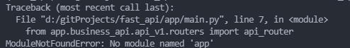

# 部署FastAPI

## Uvicorn

- `Uvicorn` 是基于 `uvloop` 和 `httptools` 构建的非常快速的 `ASGI` 服务器。
- `Uvicorn` 提供一个轻量级的方法来运行多个工作进程，比如 `--workers 4` ，但是并没有提供进行的监控。 

## Gunicorn

- `Gunicorn` 是成熟的，功能齐全的服务器，`Uvicorn` 内部包含有 `Gunicorn` 的 `workers` 类，允许你运行 `ASGI` 应用程序，这些 `workers` 继承了所有 `Uvicorn` 高性能的特点，并且给你使用 `Gunicorn` 来进行进程管理。
- 用来管理`Uvicorn`

## 使用Gunicorn和Uvicorn的worker类生产环境部署

### I、Liunx命令行后台启动

```bash
nohup gunicorn -c main:app --host 0.0.0.0 --port 8080 -w 4 -k uvicorn.workers.UvicornWorker
```

### II、 docker部署

#### 1. Gunicorn配置文件(gunicorn.conf.py)

```python
import multiprocessing

# 是否开启debug
debug = True

# 设置守护进程
# daemon = True

# 绑定ip和端口号
bind = '0.0.0.0:8000' 

# 超时时间
timeout = 30 

# 工作模式
worker_class = 'uvicorn.workers.UvicornWorker'

# 进程数
workers = multiprocessing.cpu_count() * 2 + 1 

# 设置证书
# keyfile = ''
# certfile = ''

# 日志级别，这个日志级别指的是错误日志级别，而访问日志的级别无法设置
loglevel = 'debug' 

# 日志配置
# 访问日志文件
accesslog = "/tmp/gunicorn_fasttest_access.log"      
# 错误日志文件
errorlog = "/tmp/gunicorn_fasttest_error.log"        
# OR 
# 配置文件方式配置日志
# logconfig = "./logger.ini"
```

#### 2. Dockerfile文件

- 需要先进行安装所需系统依赖()
- 然后安装python依赖包
- 指定容器中可以暴露的端口（EXPOSE）
- 运行容器时，需要执行的命令（ENTRYPOINT）
- `--preload` 此参数可查看详细的报错信息
```dockerfile
FROM python:3.8.5

LABEL author="Desire"
LABEL desc="web fastapi"

COPY . /app

WORKDIR /app

RUN apt-get update && apt-get install -y build-essential gcc libc-dev make python3-lxml \
&& pip install -r requirements.txt -i http://mirrors.aliyun.com/pypi/simple


EXPOSE 8000

ENTRYPOINT ["gunicorn", "--preload", "-c", "gunicorn.conf.py", "main:app"]
```

#### 3. 构建镜像

```bash
docker build -t fastapi_gunicorn:v1 -f Dockerfile .
```


#### 4. 运行容器

```bash
docker run -di -p 8000:8000 --name fastapi_gunicorn fastapi_gunicorn:v1
```

#### 5. 小拓
1）如果`gunicorn.conf.py`文件和`main.py`没有在同一个目录下

**目录如下：**
```bash
├── app
│   └── main.py
├── Dockerfile
├── gunicorn.conf.py
├── requirements.txt
└── start.sh
```
2）启动的时候可以使用`shell脚本（start.sh）`进行启动

- 先进入到main.py目录

- 指定启动配置文件时使用`../gunicorn.conf.py`表示上一级目录下的`gunicorn.conf.py`

```sh
cd app
gunicorn --preload -c ../gunicorn.conf.py main:app
```
3）Dockerfile只需要把启动命令换成执行shell脚本即可
```dockerfile
ENTRYPOINT [ "bash", "start.sh" ]
```

#### 6. 导包问题



##### 报错原因：

- 入口文件放在app文件夹中，启动时的寻包路径就从app开始了，所以找不到包

##### 解决：

- 把入口文件main.py放到项目根目录下