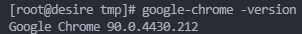

# CentOS 8 安装无头谷歌浏览器

## 第一步：下载安装包

```bash
wget https://dl.google.com/linux/direct/google-chrome-stable_current_x86_64.rpm
```

## 第二步：进行安装

```bash
yum install -y google-chrome-stable_current_x86_64.rpm
```

## 第三步：检查是否安装成功

```bash
google-chrome -version
```



