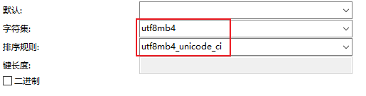
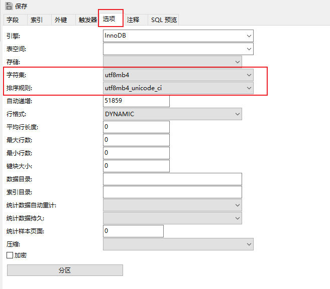
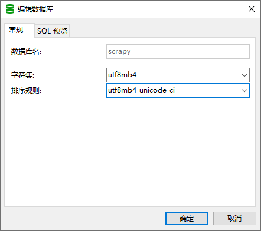

# MySQL修改字符集支持emoji表情

## utf8mb4
**一般我们数据编码格式默认设置为utf-8, 但是utf-8并不支持表情,而表情需要utf8mb4字段(向下兼容utf-8)**

## 一、单个字段修改字符集

```bash
ALTER TABLE table_name CHANGE column_name column_name VARCHAR(191) CHARACTER SET utf8mb4 COLLATE utf8mb4_unicode_ci;
```

OR



## 二、整张表修改字符集

```bash
ALTER TABLE table_name CONVERT TO CHARACTER SET utf8mb4 COLLATE utf8mb4_unicode_ci;
```

OR



## 三、整个数据库修改字符集

```bash
ALTER DATABASE database_name CHARACTER SET = utf8mb4 COLLATE = utf8mb4_unicode_ci;
```

OR

